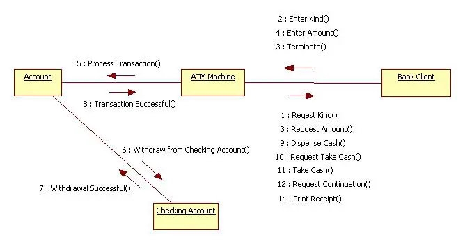
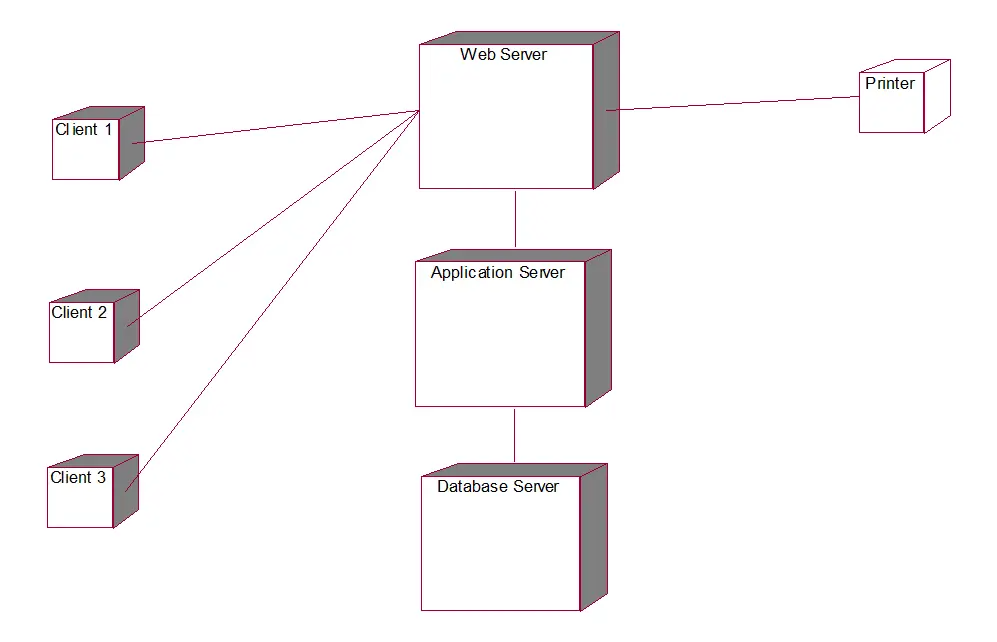
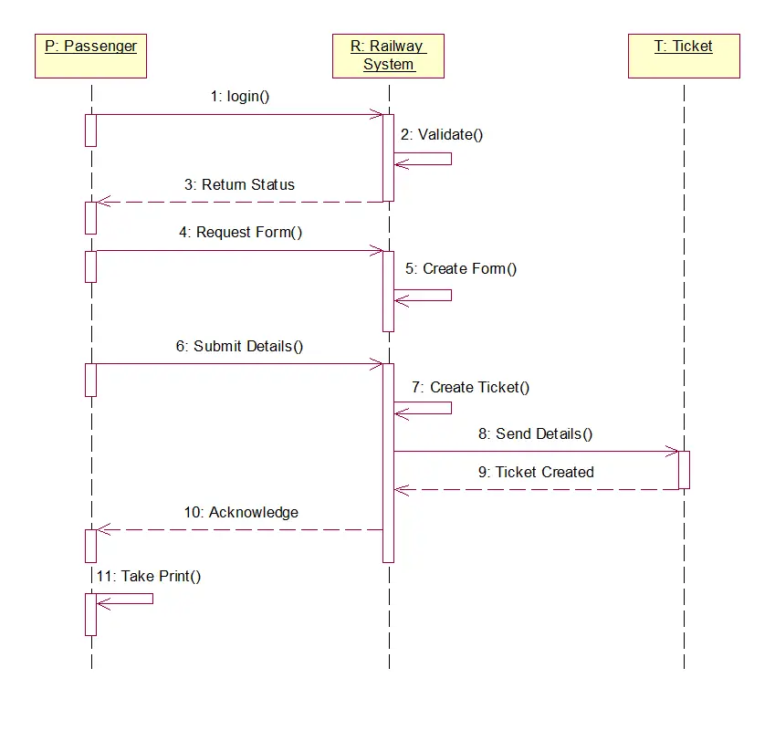
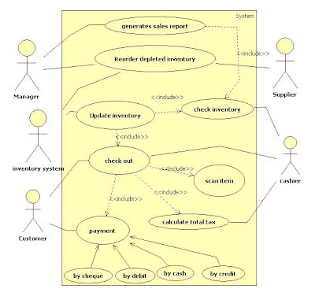
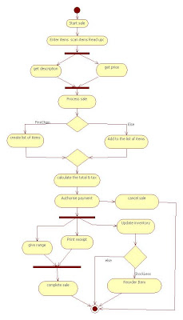
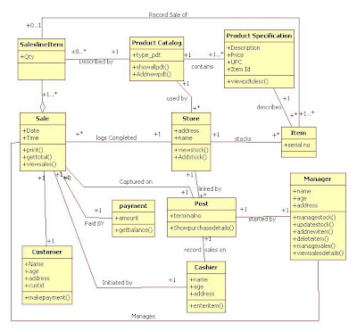

Q1)
Attempt any Five of the following :
[5 × 2 = 10]
a)
List any two advantages and disadvantages of waterfall model.
=)
The waterfall model is a sequential software development process in which progress flows downward through distinct phases, resembling a waterfall. Here are two advantages and two disadvantages of the waterfall model:

Advantages of the waterfall model:
1. Clear and well-defined stages: The waterfall model follows a systematic approach with distinct phases such as requirements gathering, design, implementation, testing, and maintenance. Each stage has specific deliverables and objectives, providing clear milestones for progress evaluation and project management.

2. Easy to understand and use: The waterfall model is simple and easy to understand, making it accessible to both technical and non-technical stakeholders. The linear progression of stages allows for a structured approach to software development, making it easier to plan and manage projects.

Disadvantages of the waterfall model:
1. Lack of flexibility and adaptability: The waterfall model is based on a rigid sequential approach, which means that each phase must be completed before moving on to the next. This can be a disadvantage when requirements change or new information arises during development, as it may require going back to previous stages, leading to delays and increased costs.

2. Limited user involvement until the testing phase: In the waterfall model, user involvement is typically limited until the testing phase, as most of the development work happens in earlier stages. This can result in a lack of early feedback and potential misunderstandings between developers and users, leading to the delivery of a product that does not fully meet the user's needs.

b)
What is the use of section 9 in SRS format.
=)
In the context of the SRS (Software Requirements Specification) format, Section 9 typically refers to the "System Features" section. This section provides a detailed description of the various features and functionalities that the software system is expected to deliver. It serves as a comprehensive inventory of the system's capabilities and helps stakeholders understand the scope and behavior of the software.

The System Features section typically includes the following information:

1. Feature identification: Each feature is identified and labeled with a unique identifier or name for easy reference.

2. Feature description: A clear and concise description of each feature is provided, explaining its purpose and functionality.

3. Feature dependencies: If any features have dependencies on other features, such dependencies are mentioned in this section. This helps to highlight any interdependencies between different aspects of the system.

4. Feature requirements: The specific requirements related to each feature are documented. This includes functional requirements (e.g., inputs, outputs, processing logic) as well as non-functional requirements (e.g., performance, security, usability) associated with each feature.

5. Acceptance criteria: The criteria for determining whether a feature has been successfully implemented are outlined. These criteria act as benchmarks for evaluating the completeness and correctness of the system's features.

c)
Define Role Names.
=)
A role name is a name that uniquely identifies one end of an association. It specifies a role of an object of a class which it plays in the association. A role name is written next to the association line near the class that plays the role.

d)
What is meant by Inception.
=)
In the context of software development, "inception" refers to the initial phase or stage of a project or software development lifecycle. It marks the beginning of the project, where the project's feasibility, scope, and objectives are determined and clarified.

During the inception phase, the primary goal is to gather information, understand the project's requirements, and define its scope. The key activities and outcomes of the inception phase may vary depending on the software development methodology being used, but typically include:

1. Project initiation: The project team is assembled, and the project's objectives, goals, and constraints are identified. The project's vision and high-level requirements are established.

2. Feasibility analysis: The technical and financial feasibility of the project is assessed. This involves evaluating potential risks, considering resource availability, estimating costs and timelines, and determining if the project is viable.

3. Stakeholder identification and analysis: Stakeholders, including end-users, customers, and other relevant parties, are identified and their needs, expectations, and concerns are gathered. Stakeholder analysis helps in understanding their impact on the project and ensuring their requirements are addressed.

4. Requirement elicitation: Requirements gathering techniques, such as interviews, workshops, or surveys, are employed to collect detailed and specific requirements. The focus is on understanding the problem domain and defining the functional and non-functional requirements of the software system.

5. Scope definition: The project's scope is defined, outlining what features and functionalities will be included and what will be excluded. This helps establish boundaries and provides a clear understanding of the project's deliverables.

6. Initial project planning: High-level project planning is conducted, including creating a preliminary project schedule, identifying major milestones, and estimating resource requirements.

e)
Define forking.
=)
Forking is a concept commonly used in the context of version control systems, particularly in distributed version control systems like Git. It involves creating a copy of a software project's code repository to establish an independent and separate development path. When a fork is created, the original project's codebase is duplicated, and the forked repository becomes a standalone project with its own version history.

Here are a few key points about forking:

1. Purpose of forking: Forking is often done when a developer or a group of developers want to take an existing project in a different direction or contribute changes that may not align with the goals of the original project. Forking allows developers to have full control over their own copy of the project and make modifications independently.

2. Independence from the original project: Once a fork is created, the forked repository is separate from the original project. The forked project can be modified, extended, and managed independently, with its own set of contributors and development roadmap.

3. Potential for collaboration: Forking also enables collaborative development. Other developers can discover the forked project and contribute changes to it by creating their own branches, making modifications, and submitting pull requests to propose changes back to the original project or the forked repository itself.

4. Maintaining a connection to the original project: While a forked repository is independent, it may still have a connection to the original project from which it was forked. This connection allows for tracking the progress of the original project, pulling updates from it, or even merging changes from the original project back into the forked repository if desired.

5. Common in open-source development: Forking is particularly prevalent in the open-source software development community, where it offers a way for developers to explore alternative approaches, experiment with new features, or create specialized versions of existing projects.

f)
What is realization.
=)
In software engineering, "realization" refers to the process of implementing or constructing a software system or component based on a design or specification. It involves transforming the abstract concepts, structures, and behaviors described in the design into actual working code or software artifacts.

Realization can be understood as the translation of design artifacts, such as architectural diagrams, class diagrams, or sequence diagrams, into executable code. It involves writing the necessary code, configuring the system components, and integrating various software modules to create the functional software system.

Here are a few key points about realization in software engineering:

1. Design-to-code translation: Realization bridges the gap between design and implementation. It takes the design artifacts, which provide a blueprint of the software system, and converts them into executable code that performs the desired functions.

2. Programming and development: Realization involves writing code using programming languages, frameworks, libraries, and other development tools. Developers use the design specifications to guide their coding efforts and ensure that the software system is implemented according to the intended design.

3. Component integration: Realization includes integrating different software components to build the complete system. This may involve connecting modules, libraries, databases, external APIs, or other dependencies to create a cohesive and functional software solution.

4. Testing and validation: Once the realization phase is complete, the software system is typically subjected to various testing techniques to verify its correctness, functionality, and adherence to requirements. Testing ensures that the realized system behaves as expected and meets the specified criteria.

5. Iterative and incremental process: Realization often follows an iterative and incremental approach, where the software system is implemented in stages or iterations. Each iteration adds new functionality or refines existing features, allowing for feedback, testing, and continuous improvement.

g)
List the types of inheritance.
=)
In object-oriented programming, inheritance is a mechanism that allows a class to inherit properties and behaviors from another class. There are several types of inheritance, each serving different purposes. Here are some common types of inheritance:

1. Single inheritance: Single inheritance involves inheriting properties and behaviors from a single parent class. A derived class extends the functionality of the base class by adding new features or overriding existing ones.

2. Multiple inheritance: Multiple inheritance allows a class to inherit from multiple parent classes. The derived class inherits properties and behaviors from multiple source classes. This feature is supported by some programming languages, such as C++, but not by all languages due to potential complexities and conflicts.

3. Multilevel inheritance: Multilevel inheritance refers to a scenario where a derived class becomes the base class for another class. In this type of inheritance, a class inherits properties and behaviors from its immediate parent class, which, in turn, inherits from its own parent class, forming a hierarchy.

4. Hierarchical inheritance: Hierarchical inheritance occurs when multiple classes inherit from a single base or parent class. In this type of inheritance, multiple derived classes share common properties and behaviors from a single source class.

5. Hybrid inheritance: Hybrid inheritance is a combination of multiple inheritance and hierarchical inheritance. It involves a mixture of single inheritance, multiple inheritance, or multilevel inheritance in the same inheritance hierarchy.

6. Interface inheritance: Interface inheritance allows a class to inherit the method signatures (function prototypes) from one or more interfaces. Interfaces define a set of methods that a class must implement, establishing a contract for the derived class to follow.

Q2)
Attempt any four of the following :
[4 × 4 = 16]
a)
Describe the coad and yourdon method in detail.
=)
The COAD and Yourdon method, also known as the Structured Systems Analysis and Design Method (SSADM), is a well-known and widely used approach to system analysis and design. It provides a structured and iterative process for developing information systems. Here's an overview of the COAD and Yourdon method:

1. Overview and Context Diagram:
The COAD and Yourdon method begins with understanding the system's context and identifying the main entities (e.g., users, external systems) that interact with it. The Context Diagram is created to depict the system boundaries and its external entities.

2. Data Flow Diagrams (DFDs):
DFDs are used to model the flow of data between different components of the system. The system is decomposed into different levels of DFDs, starting with the Context Diagram and progressively moving to lower-level diagrams, which provide more detailed representations of data flow and processes.

3. Logical Data Structure:
The Logical Data Structure represents the data requirements of the system using Entity Relationship Diagrams (ERDs). It identifies the entities, their attributes, and the relationships between them. This helps in understanding the structure and relationships of data within the system.

4. Process Modeling:
Process Modeling focuses on understanding and modeling the processes or functions within the system. Data Flow Diagrams are used to represent the processes and their interactions with data. This step helps in identifying the system's functionalities and the processing logic.

5. Data Dictionary:
The Data Dictionary is created to document and define the data elements, including entities, attributes, data types, and their relationships. It serves as a central repository of data definitions and helps in maintaining consistency and understanding across the system.

6. Object-Oriented Analysis:
In the COAD and Yourdon method, Object-Oriented Analysis (OOA) is used to identify and model objects or classes within the system. Class diagrams are created to represent the classes, their attributes, and the relationships between them.

7. User Interface Design:
User Interface (UI) Design focuses on designing the user interface elements and interactions. This step involves creating prototypes, wireframes, and screen layouts to ensure that the user interface is intuitive, user-friendly, and meets the users' needs.

8. Physical Data Design:
Physical Data Design involves designing the physical data storage structures, such as databases, tables, and file systems, based on the logical data model. This step considers factors like performance, scalability, and data integrity.

9. Implementation and Testing:
The final stages of the COAD and Yourdon method involve the actual implementation of the system, coding, and software development. The system is thoroughly tested to ensure that it functions correctly and meets the specified requirements.

The COAD and Yourdon method emphasizes a structured and iterative approach to system analysis and design, with an emphasis on understanding the system's data flow, processes, and user requirements. It provides a comprehensive framework for developing information systems and has been widely used in various industries for its clarity and practicality.

b)
Draw a collaboration diagram for ATM system.
=)

c)
Explain UML architecture.
=)
UML (Unified Modeling Language) architecture refers to the use of UML diagrams and modeling techniques to represent and describe the structure, behavior, and relationships of a software system's architectural components. UML provides a standardized visual language for architects and developers to communicate and document the design and organization of a system's architecture.

UML architecture typically involves the use of various UML diagrams, including:

1. Class Diagrams: Class diagrams depict the static structure of the system, representing classes, interfaces, relationships, and their attributes and methods. They showcase the classes and their associations, inheritance hierarchies, and dependencies.

2. Component Diagrams: Component diagrams illustrate the high-level components of a system and their interconnections. They help visualize the modular structure of a system, including libraries, modules, and subsystems.

3. Package Diagrams: Package diagrams provide a way to organize and group related elements of a system into packages. They show the dependencies and relationships between packages and their contents.

4. Deployment Diagrams: Deployment diagrams showcase the physical deployment of software components on hardware infrastructure. They illustrate how software artifacts are distributed across nodes such as servers, workstations, and devices.

5. Composite Structure Diagrams: Composite structure diagrams depict the internal structure of a single class or component, highlighting its internal parts, ports, connectors, and collaborations.

6. Behavioral Diagrams: Behavioral diagrams, such as sequence diagrams, activity diagrams, and state machine diagrams, can also be used to capture the dynamic aspects of the system's architecture. They showcase the interactions, flows, and state transitions among architectural components.

UML architecture helps in documenting and communicating the design decisions, dependencies, and interactions among architectural components in a standardized and visual manner. It enables software architects and developers to gain a holistic view of the system's structure and behavior, aiding in system analysis, design, and maintenance. Additionally, UML diagrams can serve as blueprints for implementation, ensuring a consistent and well-defined architecture throughout the software development process.

d)
What is object orientation? State various reasons for why object orientation.
=)
Object orientation is a programming paradigm that organizes software design and development around objects, which are instances of classes representing real-world entities or concepts. It emphasizes encapsulation, inheritance, and polymorphism as key principles for modeling and structuring software systems. Here are several reasons why object orientation is widely used in software development:

1. Modularity and Reusability: Object-oriented programming (OOP) promotes modularity by encapsulating data and methods within objects. This allows for easier code maintenance, as changes to one object do not necessarily affect others. Additionally, objects can be reused in different contexts, leading to more efficient and productive development.

2. Code Organization and Maintainability: OOP provides a structured approach to organizing code, making it easier to understand, modify, and maintain. The use of classes and objects allows for a clear separation of concerns and promotes code readability.

3. Abstraction and Encapsulation: OOP allows developers to create abstract representations of real-world entities by defining classes with relevant attributes and behaviors. Encapsulation ensures that the internal workings of an object are hidden, and access to its data and methods is controlled. This promotes information hiding and provides a clean interface for interacting with objects.

4. Inheritance and Code Reuse: Inheritance enables the creation of hierarchical relationships between classes, where child classes inherit properties and behaviors from parent classes. This promotes code reuse and allows for the extension and specialization of existing classes without duplicating code. Inheritance facilitates the modeling of complex relationships and promotes a more efficient development process.

5. Polymorphism and Flexibility: Polymorphism allows objects of different classes to be treated as instances of a common superclass. This enables the use of a single interface to represent multiple types, improving flexibility and facilitating dynamic behavior. Polymorphism simplifies code maintenance, as modifications to the superclass can affect all its subclasses uniformly.

6. Collaboration and Teamwork: Object orientation aligns well with collaborative software development. OOP supports the creation of objects that can be developed independently by different team members, facilitating concurrent development and integration. It also promotes code modularity and reduces the likelihood of code conflicts and dependencies.

7. Modeling Real-World Concepts: Object orientation provides a natural and intuitive way to model real-world entities and relationships in software systems. By mapping objects to real-world concepts, OOP improves the clarity and comprehensibility of the code, making it easier for developers to understand and communicate system designs.

Overall, object orientation offers numerous advantages, including code modularity, reusability, maintainability, and flexibility. It enables developers to create well-structured, scalable, and extensible software systems that closely align with the problem domain they are addressing.

e)
What is class diagram. Explain with Notations.
=)
A class diagram is a type of UML (Unified Modeling Language) diagram that represents the structure and relationships of classes in a system. It provides a visual representation of the classes, their attributes, methods, and associations. Class diagrams are widely used in object-oriented analysis and design to document and communicate the static structure of a software system. Here's an explanation of the notations used in class diagrams:

1. Class Box:
A class box represents a class and is typically divided into three compartments:

- Top Compartment: The top compartment contains the name of the class.
- Middle Compartment: The middle compartment lists the attributes or properties of the class, usually in the form of name: type.
- Bottom Compartment: The bottom compartment displays the methods or operations of the class, often represented as name(parameters): return type.

2. Associations:
Associations represent the relationships between classes. They are depicted by lines connecting class boxes. The endpoints of the line may have arrowheads to indicate the direction of the association. Multiplicity notations can be added near the ends of the association line to specify the number of instances involved in the relationship.

- One-to-One Association: Shown as a single line connecting two classes.
- One-to-Many Association: Represented by a line with a filled arrowhead pointing to the "many" side class and a simple line on the other end.
- Many-to-Many Association: Displayed with lines on both ends, often with a crow's foot notation or multiplicity symbols indicating the cardinality of the relationship.

3. Inheritance and Generalization:
Inheritance represents an "is-a" relationship between classes, where a subclass inherits the attributes and behaviors of a superclass.

- Inheritance Arrow: Shown as a line with a hollow arrowhead pointing to the superclass. The superclass is placed above the subclass.
- Abstract Class: An abstract class is denoted by italicized text or by including the word "abstract" in the class box.

4. Interfaces:
Interfaces define a set of methods that a class must implement. They are depicted as a class box with the name preceded by a stereotype notation (<<interface>>).

5. Aggregation and Composition:
Aggregation and composition represent whole-part relationships between classes.

- Aggregation: Depicted by a line with a hollow diamond on the container side. It signifies a weak relationship where the parts can exist independently of the whole.
- Composition: Shown as a line with a filled diamond on the container side. It represents a strong relationship where the parts are tightly bound to the whole and cannot exist independently.

6. Dependency:
Dependency represents a relationship where a change in one class may affect another class.

- Dependency Arrow: Depicted as a dashed line with an arrowhead pointing from the dependent class to the class it depends on.

Q3)
Attempt any four of the following :
[4 × 4 = 16]
a)
Draw the deployment diagram for railway reservation system.
=)

image

b)
What is meant by Iterative development state it's various advantages.
=)
Iterative development is a software development approach that involves repeatedly cycling through the stages of planning, designing, building, and testing in small increments called iterations. Each iteration results in a working product increment that is reviewed, refined, and used as a foundation for the next iteration. The process continues until the desired final product is achieved. Here are several advantages of iterative development:

1. Flexibility and Adaptability: Iterative development allows for flexibility and adaptability to changing requirements and feedback. As the project progresses, stakeholders can provide input and make adjustments to the product based on evolving needs and insights gained from each iteration.

2. Early and Continuous Feedback: With iterative development, stakeholders get early access to working prototypes and can provide feedback throughout the development process. This facilitates the identification of potential issues or improvements early on, reducing the likelihood of costly rework at later stages.

3. Incremental Delivery: Each iteration in iterative development delivers a working product increment, allowing stakeholders to start using and benefiting from the software earlier. This provides opportunities for early validation, testing, and gathering user feedback, which can improve the overall quality of the final product.

4. Risk Mitigation: By breaking the development process into smaller iterations, risks and uncertainties can be addressed incrementally. Issues and challenges that arise during one iteration can be identified, addressed, and mitigated before they impact subsequent iterations. This reduces the overall project risk and increases the chances of project success.

5. Enhanced Collaboration: Iterative development promotes collaboration among team members and stakeholders. Regular feedback loops and close interaction between developers, testers, designers, and users foster effective communication, shared understanding, and a sense of collective ownership. This leads to better collaboration and alignment towards project goals.

6. Faster Time to Market: Iterative development enables the delivery of working software increments in shorter cycles. This allows for a more rapid response to market demands, enabling organizations to release new features or improvements more quickly. It can give businesses a competitive advantage by getting products to market faster.

7. Continuous Improvement: Through iterative development, the development team can continually learn from previous iterations and improve the product incrementally. Each iteration provides an opportunity to reflect, evaluate, and incorporate lessons learned, leading to a more refined and high-quality end product.

8. Reduced Costs: Iterative development can help control and reduce development costs. Early identification and resolution of issues, combined with ongoing feedback and refinement, minimize the chances of costly rework or major revisions later in the development cycle.

c)
Define sequence diagram. Explain different kind of it's notations.
=)
A sequence diagram is a type of UML (Unified Modeling Language) diagram that illustrates the interactions between objects or components in a system over time. It represents the flow of messages exchanged between objects, showing the order of the messages and the lifelines of the participating objects. Sequence diagrams are commonly used in software analysis and design to visualize the dynamic behavior of a system. Here's an explanation of the notations used in sequence diagrams:

1. Lifelines:
Lifelines represent the objects or components involved in the interaction. They are depicted as vertical lines (also known as the participant bar) with the name of the object or component written next to it. Lifelines extend vertically across the diagram, indicating the lifespan of the object/component during the sequence of interactions.

2. Activation Boxes:
Activation boxes represent the period of time in which an object or component is active or executing a specific operation. They are depicted as boxes along the lifeline and show the duration of the execution of a method or the processing of a message.

3. Messages:
Messages represent the communication or interaction between objects/components. They can be of different types:

- Synchronous Message: Represented by a solid arrow with a solid line. It indicates a synchronous communication between objects, where the sender waits for a response before continuing.

- Asynchronous Message: Represented by a dashed arrow with an open arrowhead. It indicates an asynchronous communication between objects, where the sender continues execution without waiting for a response.

- Return Message: Represented by a dashed arrow with a labeled arrowhead. It indicates the return value or response from a method call.

- Self-Message: A self-message represents a message that an object sends to itself. It is depicted as a looped arrow going back to the same lifeline.

- Create Message: Represents the creation of a new object or instance. It is shown as a dashed arrow with a filled arrowhead pointing to the created object's lifeline.

4. Constraints and Conditions:
Constraints and conditions can be added to messages or activation boxes to provide additional information. They are represented as notes or annotations attached to the corresponding elements.

5. Combined Fragments:
Combined fragments are used to show various types of control flow and behavioral conditions within a sequence diagram. They are depicted as boxes with a label that represents the type of fragment, such as "alt" for alternative, "opt" for optional, "loop" for looping, etc.

6. Activation Bar Length:
The length of an activation bar or activation box represents the time duration of the execution or processing of a message.

These notations provide a visual representation of the sequence of interactions between objects or components in a system, helping to understand the dynamic behavior and message flow during runtime.

d)
What is association. Explain any two terms in association.
=)
In object-oriented programming, an association represents a relationship between two or more classes or objects. It describes how objects interact and collaborate with each other to fulfill certain functionalities within a system. Associations are typically depicted as lines connecting the participating classes or objects in a class diagram. Here are two terms associated with associations:

1. Multiplicity:
Multiplicity defines the cardinality or the number of instances involved in an association between two classes. It specifies how many objects of one class are associated with objects of another class. Multiplicity is indicated near the ends of the association line and can be represented using numbers or special symbols.

- One-to-One (1:1): A one-to-one association indicates that each instance of one class is associated with exactly one instance of another class. It is denoted as "1" on both ends of the association line.

- One-to-Many (1:N): A one-to-many association represents a relationship where each instance of one class is associated with multiple instances of another class. It is denoted as "1" on the one side (the class with single instances) and "N" (or *) on the many side (the class with multiple instances) of the association line.

2. Navigation:
Navigation in association refers to the direction or ability to traverse the relationship between objects. It indicates whether an object can access or reference the associated objects through the association.

- Unidirectional Association: In a unidirectional association, objects of one class can navigate to objects of another class, but the reverse navigation is not defined. It means that one class has knowledge of the other, but the other class does not have knowledge of the first class.

- Bidirectional Association: In a bidirectional association, objects of both classes can navigate to each other through the association. It allows objects in both classes to reference and access each other, enabling a two-way interaction between them.

e)
Define the following terms
=)

i)
Transition
=)
In the context of software engineering and modeling, a transition refers to a change in the state of an object or system. It represents the movement or progression from one state to another. Transitions are commonly used in various modeling techniques, such as state transition diagrams or finite state machines, to depict the behavior and flow of a system over time. Here are a few key points about transitions:

1. State Transition:
A state transition occurs when an object or system undergoes a change in its state due to certain conditions or events. It signifies the movement from one valid state to another. Transitions are triggered by events or conditions and are associated with actions or operations that take place during the transition.

2. Event or Condition:
An event or condition is the trigger that initiates a state transition. It represents an occurrence or stimulus that causes the object or system to change its state. Events can be external, such as user inputs or system signals, or internal, such as timers or system-generated events. Conditions, on the other hand, are specific criteria or situations that must be met for the transition to occur.

3. Guard Condition:
A guard condition is a logical expression or constraint that determines whether a transition can take place or not. It is evaluated at the time of the event occurrence and helps decide if the transition should be triggered based on the current state and other contextual factors. Guard conditions are often represented using boolean expressions, and if the condition evaluates to true, the transition is allowed; otherwise, it is blocked.

4. Actions:
Actions represent the activities or operations that occur during a state transition. They define the behavior or tasks executed when the transition is triggered. Actions can include updating variables, changing the state of objects, invoking methods or functions, or any other relevant operations that need to be performed during the transition.

5. Transition Labels:
Transition labels are optional textual descriptions associated with transitions. They provide additional information or clarification about the purpose, effect, or significance of the transition. Labels can be used to describe the event, action, or condition associated with the transition, aiding in understanding the system's behavior.

ii)
Concurrency
=)
Concurrency refers to the ability of a system or program to execute multiple tasks or processes concurrently, meaning they can be executed simultaneously or in overlapping time periods. Concurrency is an essential concept in software development and is particularly important in multi-threaded or distributed systems where multiple tasks need to be executed concurrently to achieve efficiency, responsiveness, and resource utilization. Here are a few key points about concurrency:

1. Parallel Execution:
Concurrency enables parallel execution of tasks by dividing them into smaller units or threads that can be executed simultaneously on multiple processors or cores. This allows for better utilization of available resources and can significantly improve the overall performance and throughput of the system.

2. Independent Execution:
Concurrent tasks are typically independent of each other, meaning they can be executed concurrently without any dependency or order requirement. This independence allows tasks to progress independently, making concurrent execution possible.

3. Synchronization and Coordination:
In concurrent systems, synchronization and coordination mechanisms are required to manage access to shared resources and ensure the correct execution order of tasks when necessary. Techniques such as locks, semaphores, and monitors are used to control access to shared data and maintain data consistency.

4. Thread Safety:
Concurrency introduces the challenge of thread safety, which refers to designing and implementing programs in such a way that they can handle concurrent access to shared resources without causing data corruption or inconsistency. Proper synchronization techniques and practices, such as mutexes or thread-safe data structures, are employed to ensure thread safety.

5. Deadlocks and Race Conditions:
Concurrency can introduce potential issues such as deadlocks and race conditions. A deadlock occurs when two or more threads are waiting for each other to release resources, resulting in a system freeze. Race conditions occur when multiple threads access and modify shared resources simultaneously, leading to unpredictable and inconsistent results. Proper synchronization and careful design are necessary to avoid such issues.

6. Concurrency Models:
There are different concurrency models and techniques, including multi-threading, multi-processing, and distributed computing. Each model has its own advantages, trade-offs, and use cases. The choice of concurrency model depends on factors such as the nature of the problem, the available hardware, and the desired performance characteristics.

iii)
Actor
=)
In the context of software engineering and system modeling, an actor is a role or entity that interacts with a system. Actors represent external entities, such as users, devices, or other systems, that interact with the system being modeled. Actors are an important concept in use case modeling and are used to define the roles and responsibilities of external entities in a system. Here are a few key points about actors:

1. Role and Responsibility:
An actor represents a role or a set of responsibilities that an external entity assumes when interacting with the system. It defines the behavior and actions that the external entity can perform in relation to the system.

2. Interaction:
Actors interact with the system through use cases, which represent the specific functionalities or tasks that the system provides. Actors initiate use cases by invoking actions or providing inputs to the system, and they can also receive outputs or responses from the system.

3. External to the System:
Actors are external entities and are not part of the system being modeled. They may be human users, other software systems, hardware devices, or any other entity that interacts with the system. Actors are considered as external agents that trigger or receive system responses.

4. Role Identification:
Actors are identified and named based on their roles and responsibilities in the system. They can be named using descriptive terms that represent their specific role or function in the context of the system. For example, in a banking system, an actor could be named "Customer" or "Bank Teller."

5. Use Case Participation:
Actors participate in use cases by initiating or being involved in specific system functionalities. They are associated with use cases to represent their involvement in a particular functionality. The interactions between actors and use cases help define the system's requirements and behavior.

6. System Boundary:
Actors are often depicted outside the system boundary in system models, such as use case diagrams or context diagrams. This visual representation indicates that actors exist outside the system and interact with it as external entities.

7. Multiple Actors:
A system can have multiple actors representing different external entities with distinct roles and responsibilities. Each actor represents a unique perspective or type of interaction with the system. Actors can collaborate or interact with each other and with the system to fulfill the system's overall objectives.

iv)
Navigation.
=)
In the context of object-oriented programming and modeling, navigation refers to the ability of an object to access or traverse relationships with other objects. It represents the way in which objects interact and navigate through associations or dependencies to access related objects or perform certain actions. Navigation is crucial for understanding the structure and behavior of an object-oriented system. Here are a few key points about navigation:

1. Object Relationships:
Objects in an object-oriented system can be related to each other through various types of relationships, such as associations, aggregations, compositions, or inheritances. Navigation allows objects to traverse these relationships and access other objects involved in the relationship.

2. Accessing Related Objects:
Navigation enables an object to access or reference other objects with which it has a relationship. For example, in a one-to-many association, an object can navigate from the "one" side to the associated objects on the "many" side. This allows objects to retrieve information, invoke methods, or perform actions on related objects.

3. Traversing Associations:
Associations represent relationships between classes or objects. Navigation allows objects to traverse these associations, moving from one end of the association to the other. For example, if a "Customer" object has an association with an "Order" object, navigation enables the customer to access the associated orders or vice versa.

4. Navigating Aggregations and Compositions:
Aggregations and compositions represent whole-part relationships between objects. Navigation allows objects to navigate from the whole to its parts or vice versa. For example, in a composition relationship between a "Car" object and its "Engine" object, navigation enables the car to access the engine or the engine to access its parent car.

5. Inheritance and Polymorphism:
Navigation plays a vital role in inheritance and polymorphism. Inheritance allows objects of a subclass to navigate to and inherit properties and methods from their superclass. Polymorphism enables objects to navigate to the appropriate implementation of a method based on the runtime type of the object.

6. Method Chaining:
Navigation can be combined with method chaining, where the result of one method call is used as the target for the next method call. This allows for concise and expressive code by chaining multiple navigation steps together.

Q4)
Attempt any four of the following :
[4 × 4 = 16]
a)
Explain generalization relationship along with stereotype.
=)
In object-oriented programming and modeling, a generalization relationship represents an inheritance or "is-a" relationship between classes or objects. It is a fundamental concept that allows one class, called the subclass or derived class, to inherit the properties, methods, and behaviors of another class, called the superclass or base class. Generalization establishes a hierarchical relationship, where the subclass inherits the characteristics of the superclass and can add or modify its own features. Stereotypes, on the other hand, provide a way to extend or annotate the semantics of a model element. Here's an explanation of both concepts:

Generalization Relationship:
The generalization relationship is represented by an arrow pointing from the subclass to the superclass in a class diagram. It signifies that the subclass inherits the attributes, operations, and relationships defined in the superclass. The subclass is considered to be a more specialized or specific version of the superclass, forming an "is-a" relationship. The subclass can extend the superclass by adding additional attributes, operations, or relationships, and can also override or specialize the inherited behavior.

Key points about generalization relationship:
1. Inheritance: Generalization enables code reuse and promotes the concept of inheritance, where subclasses inherit the characteristics of the superclass.
2. Hierarchical Structure: Generalization establishes a hierarchical structure in which subclasses inherit features from the superclass and can further specialize or extend them.
3. Inherited Features: Subclasses inherit attributes, methods, and relationships defined in the superclass, reducing redundancy and promoting modularity.
4. Overriding: Subclasses have the option to override inherited methods to provide their own implementation, allowing customization and specialization.
5. Polymorphism: Generalization supports polymorphism, where objects of the subclass can be treated as objects of the superclass, providing flexibility and extensibility.

Stereotypes:
Stereotypes are a mechanism in modeling languages, such as UML (Unified Modeling Language), to extend or annotate the semantics of model elements, including classes, interfaces, or relationships. Stereotypes provide a way to define custom tags or labels that can be applied to model elements to convey additional information or special meanings. Stereotypes are typically depicted as textual annotations placed above or below the element name or as small icons attached to the element.

Key points about stereotypes:
1. Extended Semantics: Stereotypes extend the standard semantics of modeling elements and provide additional information or domain-specific meanings.
2. Customization: Stereotypes allow modelers to define custom stereotypes to capture specific characteristics or requirements of the system being modeled.
3. Visual Representation: Stereotypes can be visually represented using textual annotations or icons to distinguish stereotyped elements from standard elements.
4. Tagged Values: Stereotypes can define tagged values, which are additional properties or attributes associated with stereotyped elements to provide more detailed information.

b)
Write short note on Type and Roles.
=)
Certainly! Here's a short note on types and roles:

Types:
In software engineering, a type refers to a classification or category of objects or entities based on their characteristics, attributes, and behaviors. Types serve as blueprints or templates that define the common properties and behaviors shared by objects of the same category. They provide a way to organize and categorize objects, ensuring consistency and facilitating code reuse. Types can be defined using classes in object-oriented programming or data types in other programming paradigms. They help establish a clear structure and define the capabilities and constraints of objects within a system.

Roles:
Roles represent the behaviors, responsibilities, or functions that objects or entities assume within a system. In software modeling, roles describe the specific interactions and collaborations between objects and the part they play in achieving the system's functionality. Objects can take on different roles in different contexts or scenarios, allowing for dynamic behavior and adaptability. Roles help define the responsibilities, relationships, and behaviors associated with objects during their interactions, enabling effective communication and cooperation between system components.

Key Points:
- Types classify objects into categories based on shared characteristics and behaviors.
- Types provide blueprints or templates for creating objects with consistent properties and behaviors.
- Roles describe the specific behaviors and responsibilities that objects assume within a system.
- Objects can play different roles in different situations, allowing for dynamic behavior.
- Types and roles work together to organize and structure objects and define their behaviors and interactions within a system.

c)
Explain understanding requirement of object oriented analysis.
=)
Understanding requirements in object-oriented analysis involves a comprehensive process of gathering, analyzing, and clarifying the needs, functionalities, and constraints of a software system. It focuses on understanding the problem domain, identifying objects and their behaviors, and defining the system's requirements using an object-oriented approach. Here's a breakdown of the steps involved in understanding requirements in object-oriented analysis:

1. Eliciting Requirements:
The process begins by eliciting requirements from stakeholders, including end-users, clients, and domain experts. This involves conducting interviews, workshops, and discussions to understand their needs, expectations, and constraints. Requirements can be gathered through various techniques such as brainstorming, use case modeling, scenario analysis, and prototyping.

2. Identifying Objects:
One of the key aspects of object-oriented analysis is identifying the objects in the problem domain. Objects represent entities, concepts, or things that are relevant to the system. By analyzing the requirements, you identify the objects involved and their relationships. This helps in understanding the structure of the system and the interactions between objects.

3. Analyzing Behaviors:
Next, the behaviors of the objects are analyzed. This involves identifying the actions or operations that objects perform and how they interact with each other. Use case modeling is commonly used to capture the functional requirements and describe the scenarios or interactions between objects. It helps in understanding the system's behavior and the specific actions performed by objects.

4. Defining Object Responsibilities:
Once the objects and their behaviors are identified, their responsibilities are defined. Object responsibilities include the data and behavior that objects should possess. This includes identifying the attributes (data) that objects should have and the methods (behaviors) they should perform. This step helps in understanding the roles and responsibilities of objects in the system.

5. Analyzing System Constraints:
Understanding the system's constraints is crucial for developing a successful software system. Constraints can include technical limitations, performance requirements, security constraints, regulatory compliance, or any other factors that influence the system design. Analyzing these constraints helps in identifying any limitations or restrictions that need to be considered during the design and implementation phases.

6. Prioritizing and Validating Requirements:
Once the requirements are gathered and analyzed, they need to be prioritized based on their importance and feasibility. It is important to validate the requirements with stakeholders to ensure accuracy and completeness. Feedback and reviews help in refining and clarifying the requirements, making sure that they align with the stakeholders' needs.

7. Documenting Requirements:
Finally, the requirements need to be documented in a clear and structured manner. This typically involves creating requirement specifications, use case documents, class diagrams, and other artifacts that capture the system requirements. Proper documentation ensures a shared understanding among stakeholders and serves as a reference for the development team.

d)
Explain which diagrams are called as on interaction diagram. Explain with example.
=)
Interaction diagrams in UML (Unified Modeling Language) are used to illustrate the dynamic behavior and interactions among objects or components within a system. They focus on capturing the flow of messages and the sequence of interactions between objects during a specific scenario or use case. There are two types of interaction diagrams: sequence diagrams and collaboration diagrams.

1. Sequence Diagrams:
Sequence diagrams depict the interactions between objects over a specific period, showcasing the sequence of messages exchanged among objects. They illustrate the chronological order of these messages and help visualize the dynamic behavior of the system. Sequence diagrams use vertical lifelines to represent objects or actors involved in the interaction, and arrows to represent the messages exchanged between them.

Example:

2. Collaboration Diagrams:
Collaboration diagrams, also known as communication diagrams, emphasize the structural organization of objects and the interactions between them. They focus on visualizing the relationships and interactions between objects involved in a particular scenario. Collaboration diagrams use object nodes to represent objects or actors, and connecting lines to represent the messages exchanged between them.

Example:

e)
What is package? Explain it with import and export stereotypes.
=)

Q5)
Attempt the following :
[12]
a)
Construct a design element for point of the sale terminal management
system that can be used for buying and selling of goods in the retail
shop. When the customer arrives at the post check point with the items
to purchase, the cashier records each item price and add the item
information to the running sales transaction. The description and price
of the current items are displayed. On completion of the item entry the
cashier informs the sales totals and tax to the customer. The customer
chooses payment type (cash, cheque, credit/debit) After the payment is
made the system generates a receipt and automatically updates the
inventory, the cashier handovers the receipt to the customer.
Consider above situation draw the following UML diagram.
i)
Use case diagram.
=)

ii)
Activity diagram.
=)

iii)
Class diagram
=)

