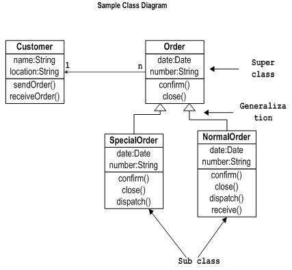
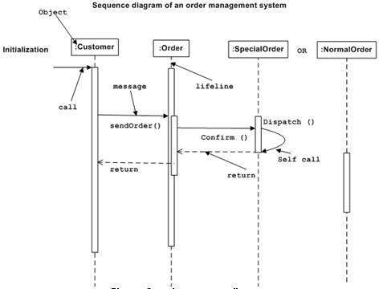
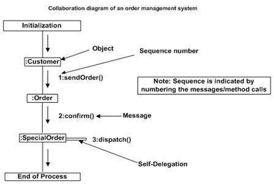
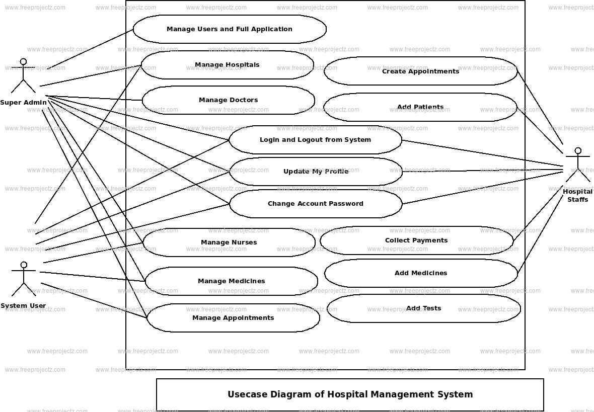
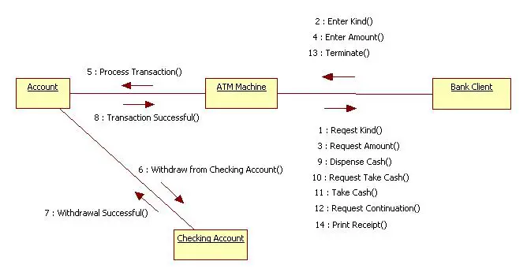
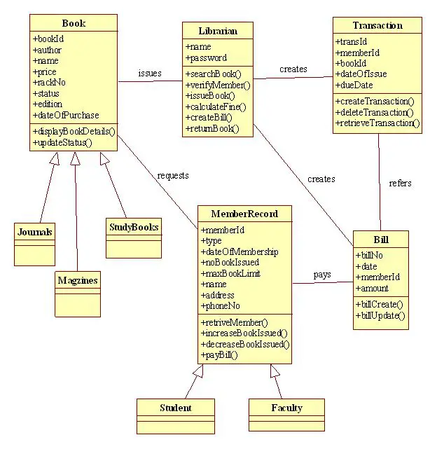
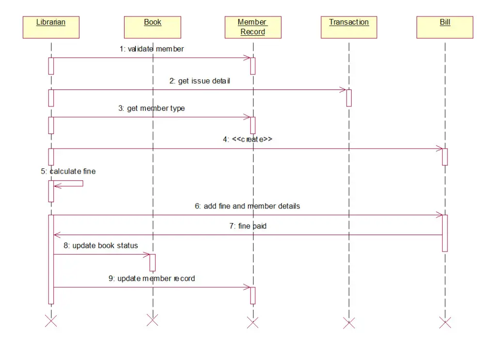
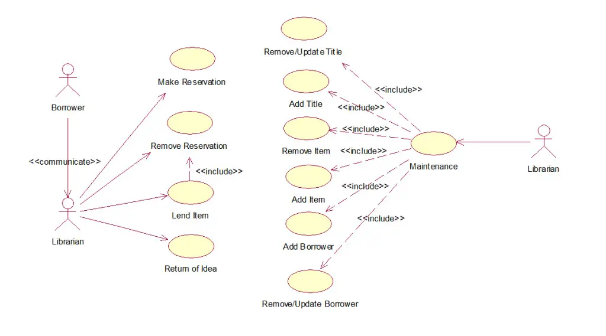
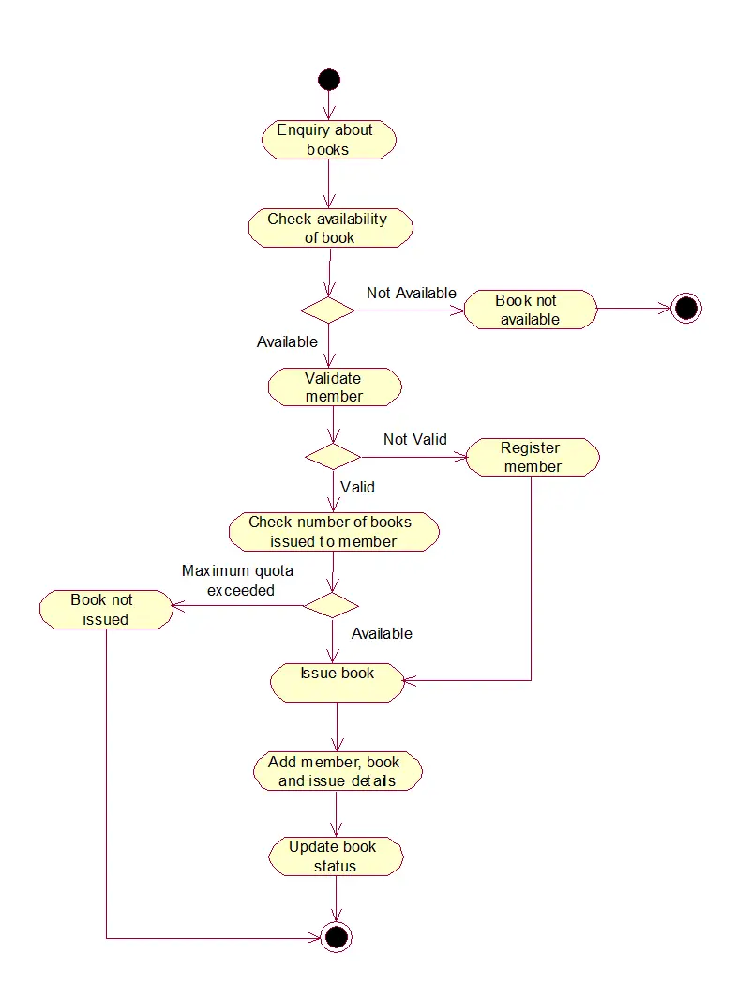

1.
Attempt any eight of the following :
8×2=16
(a)
What is Inheritance ?
=)

Inheritance is a fundamental concept in object-oriented programming (OOP) where classes can inherit properties and behaviors from other classes.
It facilitates code reuse and modularity by allowing subclasses to inherit attributes and methods from a superclass.
Subclasses, also known as derived or child classes, are specialized versions of the superclass or parent class.
They inherit the attributes and methods of the superclass, which promotes a hierarchical structure in the class system.
Inheritance allows subclasses to extend and customize the functionality of the superclass to meet specific requirements.
It provides a mechanism for creating class hierarchies and organizing related classes based on their similarities and differences.
Inheritance enables the concept of "is-a" relationship, where a subclass is considered to be a type of the superclass.
Through inheritance, subclasses can inherit the state and behavior of the superclass, leading to more efficient and modular code development.

(b)
Define Tagged Values.
=)
Tagged values are a feature in UML (Unified Modeling Language) that allow additional information to be attached to model elements. They provide a way to extend the standard UML notations and represent specific properties or characteristics of the elements. Tagged values can be used to capture additional metadata, annotations, constraints, or any other information that is not explicitly represented in the standard UML elements. They serve as an extension mechanism, allowing users to add custom properties to model elements beyond the predefined set of UML attributes and operations. Tagged values offer customizable information by defining and assigning custom attributes or properties to model elements based on specific requirements. They can hold any type of data, such as strings, numbers, dates, or even complex structures. This flexibility enables users to enrich the model with domain-specific or project-specific information. By utilizing tagged values, the UML models become more expressive, detailed, and tailored to the needs of the project or domain.


(c)
What is Realization ?
=)

Realization is a relationship in UML (Unified Modeling Language) that represents the implementation of an interface or the fulfillment of a contract by a class or component. It signifies that a class or component is responsible for providing the implementation for the behavior defined in an interface or abstract class. Realization establishes a connection between the implementing class and the interface it realizes. It represents a stronger form of relationship than mere dependency or association. Realization is depicted using a dashed line with a triangular arrowhead pointing towards the interface being realized. The realizing class or component is connected to the interface with the realization relationship. Realization enables the decoupling of interfaces from their implementation, promoting modularity, flexibility, and maintainability. It allows different classes or components to provide their own implementation for the same interface, enhancing extensibility and facilitating polymorphism. Realization is an essential concept in object-oriented design and is particularly useful in scenarios where interface-based programming and abstraction are employed.

(d)
Define Branching.
=)
Branching in object-oriented software engineering is typically achieved using version control systems, such as Git. Developers create separate branches, each representing a different set of changes or additions to the code. These branches provide isolation for specific development tasks, allowing developers to work on different parts of the software concurrently.

By creating branches, developers can experiment with new features or make changes without impacting the stability of the main codebase. It enables parallel development, where different team members can work on different aspects of the software simultaneously.

Branches can later be merged back into the main codebase when the changes are deemed stable and ready for integration. Merging involves combining the changes from one branch into another, allowing the main codebase to incorporate the new features or bug fixes.

In summary, branching in object-oriented software engineering provides a mechanism for parallel development, isolation of changes, and controlled integration of features. It facilitates collaboration among developers and helps manage the complexity of software projects.


(e)
What is Swimlanes.
=)
Swimlanes, also known as swimlane diagrams or cross-functional diagrams, are a visual representation technique used to illustrate the flow of activities or processes across different roles, departments, or individuals within a system or organization. They provide a clear and structured view of how tasks or responsibilities are distributed and coordinated among various entities.

In a swimlane diagram, the diagram is divided into vertical or horizontal lanes, with each lane representing a specific role, department, or participant involved in the process. The activities or tasks are depicted as horizontal or vertical arrows that traverse the swimlanes, indicating the flow of work or information between different entities.

The primary purpose of swimlanes is to visualize the interactions and handoffs between different stakeholders or functional areas involved in a process. They help identify dependencies, bottlenecks, and potential areas for improvement in the workflow. Swimlanes provide a high-level overview and promote a better understanding of how different parts of an organization collaborate to achieve a common goal.

Swimlanes can be used in various domains, such as business process management, project management, software development, and system analysis. They are particularly effective for representing complex processes involving multiple roles or departments, as they provide a structured and intuitive visualization.

Overall, swimlanes serve as a valuable tool for understanding and analyzing the interactions and responsibilities of different stakeholders in a process, facilitating effective coordination and collaboration within an organization.


(f)
What is meant by concurrency ?
=)
Concurrency is the capability of a system or program to execute multiple tasks or processes concurrently, allowing for parallelism and efficient resource utilization. It involves the simultaneous execution of independent actions or operations, either within a single program or across multiple programs or threads. By leveraging concurrency, tasks can be performed concurrently, leading to improved performance and responsiveness.

Concurrent programming involves the use of multiple threads or processes that can execute independently and share resources. These threads or processes can perform different computations or operations simultaneously, enabling efficient use of available system resources.

However, concurrency introduces challenges such as race conditions, where multiple threads access shared data simultaneously and may lead to unexpected behavior. Proper synchronization mechanisms, such as locks or semaphores, are needed to ensure data integrity and avoid conflicts.

Concurrency is crucial in scenarios such as multi-user systems, real-time applications, and distributed computing, where multiple activities need to be performed concurrently. It enables efficient use of modern multi-core processors and improves overall system performance.

In summary, concurrency enables the execution of multiple tasks or processes simultaneously, leading to improved performance and resource utilization. It is a fundamental concept in modern software development and plays a vital role in building efficient and scalable systems.


(g)
Define polymorphism.
=)
Polymorphism is a fundamental concept in object-oriented programming (OOP) that allows objects of different classes to be treated as objects of a common superclass. It enables a single interface or method to be used to represent multiple forms or behaviors.

In polymorphism, objects can exhibit different behaviors based on their specific class or type. This means that objects of different classes can respond differently to the same method call, providing different implementations based on their specific context.

Polymorphism is achieved through method overriding and method overloading. Method overriding allows a subclass to provide its own implementation of a method defined in its superclass, while method overloading allows multiple methods with the same name but different parameters to coexist within a class.

Polymorphism enhances code reusability, modularity, and flexibility. It enables the creation of generic code that can operate on objects of different classes, simplifying the development process and making the code more adaptable to changes. Polymorphism also facilitates the use of inheritance and abstraction, allowing for code that is easier to understand, maintain, and extend.

In summary, polymorphism in OOP enables objects of different classes to be treated uniformly based on a common superclass. It allows for code to be written in a more generic and flexible manner, promoting code reuse and modularity. Polymorphism is a key feature that enhances the power and versatility of object-oriented programming languages.


(h)
What is meant by Inception ?
=)
In the context of software development and project management, inception refers to the initial phase or stage of a project where its scope, objectives, and feasibility are explored and defined. It is the starting point of a project and involves activities aimed at gathering information, understanding requirements, and setting the project's direction.

During the inception phase, key stakeholders, including project managers, business analysts, and clients, come together to identify the project's purpose, goals, and deliverables. They engage in discussions, brainstorming sessions, and feasibility studies to assess the project's viability and develop a shared understanding of its requirements and constraints.

The inception phase typically involves activities such as defining the project vision, conducting initial requirements gathering, creating a high-level project plan, estimating resource requirements, identifying risks, and outlining a preliminary project timeline and budget. It serves as a foundation for the subsequent phases of the project lifecycle.

The inception phase is crucial as it sets the project's direction, establishes the project team's shared understanding, and provides a basis for making informed decisions. It helps align the project's objectives with the organization's goals and ensures that all stakeholders are on the same page before proceeding with further development activities.

In agile methodologies, such as Scrum, the inception phase is often referred to as the project initiation or sprint zero, where the team plans, prepares, and sets up the project for subsequent iterations or sprints.

Overall, inception is the initial phase of a project where the project's purpose, goals, and feasibility are determined, setting the stage for successful project execution and delivery.


(i)
Write down the purpose of the object diagram.
=)
The purpose of an object diagram is to provide a snapshot or static view of a system at a specific point in time. It illustrates the instances of classes (objects) and their relationships within a system, emphasizing the structure and composition of objects.

The main purposes of object diagrams are as follows:

1. Visualization: Object diagrams offer a visual representation of the objects and their relationships, helping stakeholders understand the structure and organization of the system. They provide a clear and concise view of how objects interact and collaborate with each other.

2. Object Instances: Object diagrams showcase specific instances of classes at a particular moment, highlighting the objects and their attributes and associations. This allows developers and designers to examine and verify the state and behavior of objects within the system.

3. Design Validation: Object diagrams aid in validating and refining the design of a system. By visually representing objects and their relationships, designers can review and analyze the design choices, identify potential design flaws, and make necessary improvements or adjustments.

4. Communication: Object diagrams serve as a means of communication among stakeholders, including developers, designers, clients, and end-users. They provide a common visual language to discuss and understand the system's structure, allowing for effective collaboration and alignment of perspectives.

5. Documentation: Object diagrams are valuable documentation artifacts that capture the static structure of a system. They can be included in design documents, technical specifications, or system manuals to provide a detailed reference for future development, maintenance, or troubleshooting.

6. Integration Testing: Object diagrams can be used for integration testing, where the interaction and collaboration between objects are tested to ensure that the system functions correctly when different objects interact with each other.


2.
Attempt any four of the following :
[4×4=16]
(a)
Define UML. Explain architecture of UML.
=)
UML stands for Unified Modeling Language. It is a standardized modeling language used in software engineering to visually represent, design, and communicate software systems. UML provides a set of graphical notations and a common language for software developers, analysts, and stakeholders to understand, document, and analyze the structure, behavior, and interactions of a system.

The architecture of UML can be understood in terms of its different types of diagrams, which capture various aspects of a system. The main types of UML diagrams are:

1. Structural Diagrams:
   - Class Diagram: Represents the static structure of the system, including classes, their attributes, methods, and relationships.
   - Object Diagram: Depicts instances of classes and their relationships at a specific point in time.
   - Component Diagram: Shows the physical components of a system and their dependencies.
   - Package Diagram: Illustrates the organization of classes and other elements into packages or namespaces.

2. Behavioral Diagrams:
   - Use Case Diagram: Describes the interactions between actors (users or external systems) and the system to achieve specific goals.
   - Activity Diagram: Represents the flow of activities, actions, and decision points in a process or algorithm.
   - State Machine Diagram: Models the states and state transitions of an object or system in response to events.
   - Sequence Diagram: Illustrates the interactions and message exchanges between objects over time.
   - Communication Diagram: Focuses on the objects participating in a collaboration and the messages exchanged between them.

3. Interaction Diagrams:
   - Timing Diagram: Depicts the behavior of objects in response to time-based constraints and interactions.
   - Interaction Overview Diagram: Provides an overview of multiple interaction diagrams to show complex scenarios.

4. Deployment Diagram:
   - Represents the physical deployment of software components onto hardware nodes, illustrating the configuration and relationships between them.


(b)
Define class diagram. State the purpose of class diagram with example.
=)
Class diagram is a static diagram. It represents the static view of an application. Class diagram is not only used for visualizing, describing, and documenting different aspects of a system but also for constructing executable code of the software application.

Class diagram describes the attributes and operations of a class and also the constraints imposed on the system. The class diagrams are widely used in the modeling of objectoriented systems because they are the only UML diagrams, which can be mapped directly with object-oriented languages.

Class diagram shows a collection of classes, interfaces, associations, collaborations, and constraints. It is also known as a structural diagram.

Purpose of Class Diagrams
The purpose of class diagram is to model the static view of an application. Class diagrams are the only diagrams which can be directly mapped with object-oriented languages and thus widely used at the time of construction.

UML diagrams like activity diagram, sequence diagram can only give the sequence flow of the application, however class diagram is a bit different. It is the most popular UML diagram in the coder community.

The purpose of the class diagram can be summarized as −

    Analysis and design of the static view of an application.

    Describe responsibilities of a system.

    Base for component and deployment diagrams.

    Forward and reverse engineering.

Example:


(c)
What is Interaction diagram ? Describe sequence diagram with example.
=)
From the term Interaction, it is clear that the diagram is used to describe some type of interactions among the different elements in the model. This interaction is a part of dynamic behavior of the system.

This interactive behavior is represented in UML by two diagrams known as Sequence diagram and Collaboration diagram. The basic purpose of both the diagrams are similar.

Sequence diagram emphasizes on time sequence of messages and collaboration diagram emphasizes on the structural organization of the objects that send and receive messages.

Purpose of Interaction Diagrams
The purpose of interaction diagrams is to visualize the interactive behavior of the system. Visualizing the interaction is a difficult task. Hence, the solution is to use different types of models to capture the different aspects of the interaction.

Sequence and collaboration diagrams are used to capture the dynamic nature but from a different angle.

The purpose of interaction diagram is −

To capture the dynamic behaviour of a system.

To describe the message flow in the system.

To describe the structural organization of the objects.

To describe the interaction among objects.

The Sequence Diagram
The sequence diagram has four objects (Customer, Order, SpecialOrder and NormalOrder).

The following diagram shows the message sequence for SpecialOrder object and the same can be used in case of NormalOrder object. It is important to understand the time sequence of message flows. The message flow is nothing but a method call of an object.

The first call is sendOrder () which is a method of Order object. The next call is confirm () which is a method of SpecialOrder object and the last call is Dispatch () which is a method of SpecialOrder object. The following diagram mainly describes the method calls from one object to another, and this is also the actual scenario when the system is running.



The Collaboration Diagram
The second interaction diagram is the collaboration diagram. It shows the object organization as seen in the following diagram. In the collaboration diagram, the method call sequence is indicated by some numbering technique. The number indicates how the methods are called one after another. We have taken the same order management system to describe the collaboration diagram.

Method calls are similar to that of a sequence diagram. However, difference being the sequence diagram does not describe the object organization, whereas the collaboration diagram shows the object organization.

To choose between these two diagrams, emphasis is placed on the type of requirement. If the time sequence is important, then the sequence diagram is used. If organization is required, then collaboration diagram is used.




(d)
Define UP. Explain any two phases in details.
=)
UP stands for Unified Process. It is an iterative and incremental software development methodology that provides a disciplined approach to the entire software development lifecycle. UP emphasizes collaboration, flexibility, and iterative feedback to ensure the production of high-quality software systems that meet user needs.

UP is composed of several phases, each with specific objectives, activities, and deliverables. Two important phases of UP are:

1. Inception Phase:
   The Inception phase is the initial phase of the project, where the main focus is on understanding the scope and feasibility of the project. The key objectives of the Inception phase are:
   
   a. Establishing the Vision: The project vision is defined, outlining the high-level goals, objectives, and expectations of the project. This involves understanding the business needs, identifying stakeholders, and capturing the initial requirements.
   
   b. Identifying Risks and Feasibility: Potential risks, technical challenges, and project constraints are identified and analyzed. Feasibility studies are conducted to evaluate the viability of the project in terms of time, resources, and technology.
   
   c. Forming the Initial Team and Plan: The project team is assembled, including stakeholders, analysts, architects, developers, and testers. The initial project plan is created, outlining the timeline, major milestones, and resource allocation.
   
   d. Building the Business Case: The business case is developed, which includes a cost-benefit analysis, return on investment (ROI), and potential value to the organization. This helps justify the project and secure necessary resources and support.
   
   Deliverables in the Inception phase include the Vision document, initial use cases, risk assessment, project plan, and the business case.

2. Elaboration Phase:
   The Elaboration phase follows the Inception phase and focuses on establishing a solid foundation for the project. The key objectives of the Elaboration phase are:
   
   a. Refining the Requirements: Detailed requirements are gathered, analyzed, and refined based on user needs and feedback. Use case modeling, domain modeling, and prototyping techniques may be employed to ensure a clear understanding of the system requirements.
   
   b. Designing the System Architecture: The overall system architecture is designed, identifying the major components, subsystems, and their interactions. The architecture focuses on addressing key technical risks and ensuring that the system design aligns with the project goals and requirements.
   
   c. Creating the Iteration Plan: An iteration plan is developed, detailing the scope, timeline, and deliverables for each iteration. It helps in managing the iterative development process and setting expectations for the subsequent phases.
   
   d. Assessing and Mitigating Risks: Risks identified in the Inception phase are further analyzed, and strategies are developed to mitigate them. Prototypes, proof-of-concepts, or feasibility studies may be conducted to reduce technical uncertainties.
   
   Deliverables in the Elaboration phase include a refined vision document, use case model, software architecture documentation, a refined project plan, and a risk mitigation plan.


(e)
Explain Generic components of the object oriented design model.
=)
In object-oriented design, the generic components refer to the fundamental building blocks used to structure and organize software systems. These components provide a modular and reusable approach to design and implementation. The generic components in object-oriented design include:

1. Class:
   A class is a blueprint or template that defines the properties (attributes) and behaviors (methods) of objects. It encapsulates data and the operations that can be performed on that data. Classes serve as the foundation for creating objects, which are instances of a class.

2. Object:
   An object is an instance of a class. It represents a specific entity or concept in the system. Objects have their own state (values of attributes) and behavior (methods). They interact with other objects through method invocations, message passing, and data exchange.

3. Inheritance:
   Inheritance is a mechanism that allows classes to inherit properties and behaviors from other classes. It enables the creation of a hierarchy of classes, where subclasses inherit attributes and methods from their parent (super) classes. Inheritance promotes code reuse, modularity, and the concept of "is-a" relationships.

4. Encapsulation:
   Encapsulation is a principle that hides the internal details and implementation of an object. It allows objects to present a clean, well-defined interface to the outside world. Encapsulation combines data and the methods that manipulate that data into a single unit, protecting it from unwanted access and ensuring data integrity.

5. Polymorphism:
   Polymorphism enables objects of different classes to be treated interchangeably, based on a shared interface or superclass. It allows different objects to respond differently to the same message or method invocation. Polymorphism promotes flexibility, extensibility, and code reuse.

6. Abstraction:
   Abstraction involves capturing the essential characteristics and behaviors of a concept or object in a simplified and generalized manner. It focuses on the representation of relevant information while hiding unnecessary details. Abstraction helps in modeling complex systems by focusing on the key aspects and ignoring the implementation specifics.

7. Association:
   Association represents a relationship between two or more classes, indicating that objects of one class are connected to objects of another class. It captures how objects collaborate or interact with each other. Associations can have different cardinalities, such as one-to-one, one-to-many, or many-to-many, depending on the nature of the relationship.

8. Composition and Aggregation:
   Composition and aggregation are forms of association that represent part-whole relationships between classes. Composition implies a strong ownership relationship, where the lifetime of the part is dependent on the whole. Aggregation represents a looser relationship, where the parts can exist independently of the whole. These relationships help in modeling complex objects and their hierarchical structures.


3.
Attempt any four of the following :
[4×4=16]
(a)
Define thing. Explain type of things in UML.
=)
In the context of object-oriented programming and UML (Unified Modeling Language), a "thing" refers to an object or an entity that can be represented and manipulated within a system. In other words, it represents a specific instance of a class or a concept.

In UML, the types of things that can be represented are categorized into four main elements: 

1. Structural Things:
   - Class: Represents a template or blueprint for creating objects. It defines the common attributes and behaviors that objects of the class will possess.
   - Interface: Specifies a contract that a class or a component must adhere to. It defines a set of operations that the implementing class must provide.
   - Object: Represents an instance of a class. It encapsulates data (attributes) and behavior (methods) defined by its class.

2. Behavioral Things:
   - Use Case: Represents a specific functionality or behavior of a system from the perspective of an external user or actor.
   - Interaction: Describes the behavior of a system by capturing the exchange of messages between objects or components.
   - State Machine: Models the behavior of an object by defining its possible states and transitions between those states.

3. Grouping Things:
   - Package: Represents a container for organizing related elements and provides a way to manage complexity by grouping related components.

4. Annotational Things:
   - Note: Represents comments or additional information that can be attached to other UML elements to provide explanatory details.


(b)
What is Package ? Explain it with import and export stereotype.
=)
In UML, a package is a grouping mechanism used to organize related elements, such as classes, interfaces, and other packages, within a system. It helps manage the complexity of a system by providing a way to logically structure and group related components. A package acts as a container for these elements, allowing for better organization, modularization, and reusability.

A package can be depicted as a folder-like symbol in UML diagrams, and it can have various properties and characteristics associated with it. One way to further specify the behavior and relationships of a package is by using stereotypes. Stereotypes are UML extensions that allow you to define custom properties, constraints, or semantics for a specific element.

Import and Export stereotypes are commonly used with packages to indicate the relationships and dependencies between different packages. Let's explain these stereotypes:

1. Import Stereotype: 
   The import stereotype is used to represent a dependency between two packages where one package depends on elements from another package. It signifies that the importing package requires or uses elements defined in the imported package.

   For example, if Package A imports Package B, it means that Package A needs to access and use some classes, interfaces, or other elements defined within Package B to fulfill its functionality.

2. Export Stereotype:
   The export stereotype is used to represent a package that provides elements for other packages to use. It signifies that the exporting package exposes its elements to be used by other packages.

   For example, if Package B is exported, it means that other packages can import Package B and utilize the classes, interfaces, or other elements defined within it.


(c)
Draw use case diagram for Hospital Management System.
=)



(d)
Explain five UP work flows of UP in details.
=)
The Unified Process (UP) is a popular iterative and incremental software development framework that follows the principles of the Unified Modeling Language (UML). It consists of several work flows, which are distinct sets of activities that are performed during different stages of the software development process. Here are five commonly recognized work flows of UP:

1. Requirements Workflow:
   The requirements workflow focuses on understanding and documenting the needs and expectations of the system's stakeholders. It involves the following activities:

   - Requirements Elicitation: Gathering requirements from stakeholders through interviews, workshops, and other techniques.
   - Requirements Analysis: Analyzing and refining the collected requirements to identify any conflicts or ambiguities and creating a requirements specification document.
   - Requirements Validation: Ensuring that the requirements are complete, consistent, and aligned with the stakeholders' needs.

2. Analysis and Design Workflow:
   The analysis and design workflow involves transforming the requirements into a detailed design for the system. It includes the following activities:

   - Analysis: Modeling the system's structure and behavior using techniques such as use case modeling, activity diagrams, and class diagrams.
   - Design: Translating the analysis models into implementation-specific designs, including the design of components, subsystems, and interfaces.

3. Implementation Workflow:
   The implementation workflow focuses on the actual coding and development of the system. It includes the following activities:

   - Coding: Writing the software code based on the design specifications.
   - Unit Testing: Testing individual units or components of the software in isolation to ensure their correctness.
   - Integration: Combining the individual components and testing their interactions to ensure the system works as a whole.

4. Testing Workflow:
   The testing workflow is responsible for verifying and validating the system to ensure its quality and conformance to requirements. It involves the following activities:

   - Test Planning: Defining the overall testing strategy and creating test plans.
   - Test Execution: Running the tests defined in the test plans and recording the results.
   - Defect Management: Identifying and tracking defects, and working towards their resolution.

5. Deployment Workflow:
   The deployment workflow focuses on deploying the software to the target environment and ensuring its successful installation and operation. It includes the following activities:

   - System Deployment: Preparing the software for deployment, including packaging, installation scripts, and configuration management.
   - User Training: Providing training and documentation for end-users to understand and effectively use the software.
   - Transition to Maintenance: Handing over the software to the maintenance team and preparing for ongoing support and maintenance activities.


(e)
Describe the Rambaugh method in details.
=)
I apologize for the confusion, but it seems there is a misunderstanding. There is no specific "Rambaugh method" in the context of software development or methodologies. However, there is a well-known software engineering methodology called the "Unified Modeling Language" (UML), which was developed by Grady Booch, James Rumbaugh, and Ivar Jacobson. This methodology provides a standardized approach for visualizing, specifying, constructing, and documenting the artifacts of a software system.

If you are referring to the contributions of James Rumbaugh, he is one of the key contributors to the development of UML. Rumbaugh, along with Booch and Jacobson, played a significant role in merging their respective methodologies (Booch method, Objectory method, and OMT) to create the Unified Modeling Language.

UML provides a set of graphical notations and techniques that allow software developers to model various aspects of a system, such as its structure, behavior, and interactions. The key concepts and diagrams in UML include:

1. Class Diagrams: Represent the static structure of the system, including classes, interfaces, associations, and inheritance relationships.

2. Use Case Diagrams: Illustrate the system's functionality from the perspective of its users or external actors.

3. Sequence Diagrams: Depict the interactions and communication between objects or components over a specific time period.

4. Activity Diagrams: Visualize the flow of activities and workflows within the system, particularly suited for modeling business processes.

5. State Machine Diagrams: Describe the different states that an object or system can exhibit and the transitions between those states.

6. Component Diagrams: Represent the physical and logical components of the system and their dependencies.

7. Deployment Diagrams: Illustrate the hardware and software infrastructure needed to deploy the system.


4.
Attempt any four of the following :
[4×4=16]
(a)
What is meant by Model and Modeling ?
=)
In the context of software engineering and systems development, a model refers to an abstraction or representation of a system, concept, or process. It is a simplified and structured representation that captures the essential aspects of the entity being modeled. Models are created to understand, communicate, and analyze complex systems or ideas.

Modeling, on the other hand, is the process of creating and using models to represent and understand real-world phenomena. It involves selecting appropriate concepts, relationships, and notations to construct a model that accurately captures the desired aspects of the system or concept being studied.

Modeling serves several purposes:

1. Understanding: Models help in understanding complex systems or ideas by breaking them down into simpler, more manageable representations. They provide a visual or conceptual framework that aids in comprehending the underlying structure, behavior, and relationships.

2. Communication: Models act as a common language or visual tool for communication and collaboration among stakeholders. They enable effective communication by providing a shared understanding and a means to discuss and refine ideas.

3. Analysis: Models allow for analysis and evaluation of different aspects of a system. By manipulating and simulating the model, it becomes possible to explore various scenarios, test hypotheses, and predict the behavior or performance of the real system.

4. Design: Models facilitate the design process by providing a blueprint or plan for creating or improving a system. They help in visualizing the structure and behavior of the system, identifying potential issues or improvements, and guiding the development process.

5. Documentation: Models serve as documentation artifacts that capture the essential information about a system. They provide a structured representation that can be referenced and shared to convey the system's architecture, requirements, and other important aspects.

Modeling can be performed using various techniques and notations, such as UML (Unified Modeling Language), BPMN (Business Process Model and Notation), data flow diagrams, entity-relationship diagrams, and more. The choice of modeling technique depends on the specific domain, purpose, and complexity of the system being modeled.


(b)
What is classfiers ? List out different classifiers in UML with
diagram.
=)
In UML, a classifier is an abstract concept that represents a classification mechanism used to categorize and define different types of elements. Classifiers serve as the foundation for modeling the structure, behavior, and relationships of objects in a system. Here are some commonly used classifiers in UML:

1. Class:
   A class is a fundamental classifier that represents a blueprint or template for creating objects. It defines the attributes (data) and operations (behavior) that objects of the class will possess. Class diagrams are used to represent the static structure of a system, showing classes, their attributes, and relationships.

2. Interface:
   An interface defines a contract specifying a set of operations that a class or component must provide. It represents a collection of abstract methods without any implementation details. Interface diagrams are used to represent the interfaces and their relationships with other elements.

3. Enumeration:
   An enumeration is a special type of classifier that represents a set of named values. It defines a finite list of values, which are typically used to represent predefined options or states. Enumeration diagrams depict the enumeration types and their values.

4. Collaboration:
   A collaboration represents a group of classifiers (such as classes, interfaces, or components) that work together to fulfill a common purpose. Collaboration diagrams (also known as communication diagrams) illustrate the interactions and relationships between these classifiers.

5. Component:
   A component is a classifier that represents a modular and independent part of a system that encapsulates its functionality and interfaces. Component diagrams show the components, their dependencies, and the connections between them.

6. Package:
   A package is a classifier that acts as a container for organizing related elements. It provides a way to manage complexity by grouping related classifiers, such as classes, interfaces, or other packages. Package diagrams depict the organization and dependencies between different packages.

1. Class Diagram:
```
+---------------------+
|       ClassA        |
+---------------------+
| - attribute1: type1 |
| - attribute2: type2 |
|---------------------|
| + operation1()      |
| + operation2()      |
+---------------------+
```

2. Interface Diagram:
```
+-----------------------+
|      InterfaceA       |
+-----------------------+
| + operation1()        |
| + operation2()        |
+-----------------------+
```

3. Enumeration Diagram:
```
+-----------------------+
|      EnumerationA     |
+-----------------------+
| - OPTION1             |
| - OPTION2             |
| - OPTION3             |
+-----------------------+
```

4. Collaboration Diagram (simplified example):
```
  +------------+     +------------+
  |   ClassA   |     |   ClassB   |
  +------------+     +------------+
         |                  |
         | operation1()     |
         |----------------->|
         |                  |
         |                  |
         | operation2()     |
         |----------------->|
         |                  |
```

5. Component Diagram:
```
+-----------------------+
|      ComponentA       |
+-----------------------+
|                       |
|  +-----------------+  |
|  |    ClassA       |  |
|  +-----------------+  |
|                       |
+-----------------------+
```

6. Package Diagram (simplified example):
```
+---------------------+
|      PackageA       |
+---------------------+
|                     |
|  +--------------+   |
|  |   ClassA     |   |
|  +--------------+   |
|                     |
|  +--------------+   |
|  | InterfaceA   |   |
|  +--------------+   |
|                     |
+---------------------+
```


(c)
Define the collaboration diagram. Draw collaboration diagram for ATM.
=)
A collaboration diagram, also known as a communication diagram, is a type of interaction diagram in UML that illustrates the interactions and relationships between objects or classifiers to fulfill a specific behavior or scenario. It emphasizes the structural organization of objects and the messages exchanged between them to achieve a particular goal.

In a collaboration diagram, the emphasis is placed on the objects participating in the collaboration and the messages they exchange rather than the sequence of messages over time (as depicted in a sequence diagram). It visualizes the runtime relationships and interactions between objects within a specific context.

The key components of a collaboration diagram include:

1. Objects:
   Objects represent instances of classes or classifiers participating in the collaboration. They are depicted as rectangles with the name of the object inside.

2. Messages:
   Messages represent the communication between objects and are depicted as arrows labeled with the name of the message. Messages can be synchronous (denoted by a solid arrow) or asynchronous (denoted by a dashed arrow).

3. Associations:
   Associations represent the relationships between objects and are depicted as lines connecting the objects. Associations can be labeled to denote the nature of the relationship.

4. Interaction Occurrences:
   Interaction occurrences represent the lifespan of an object's participation in a collaboration and are depicted as vertical dotted lines. They show the time period during which an object is active in the collaboration.

Collaboration diagrams focus on illustrating the runtime interactions between objects and how they work together to achieve a specific behavior or goal. They provide a visual representation of object relationships and the flow of messages exchanged between them.

Here's a simplified example of a collaboration diagram:

```
  +------------+          +------------+
  |   ObjectA  |          |   ObjectB  |
  +------------+          +------------+
         |                       |
         | operation1()          |
         |---------------------> |
         |                       |
         |                       |
         | operation2()          |
         |--------------------- >|
         |                       |
```

In this example, ObjectA and ObjectB collaborate by exchanging messages. ObjectA initiates the collaboration by sending "operation1()" message to ObjectB, which responds with "operation2()" message.

Collaboration diagrams are useful for visualizing the relationships, interactions, and flow of messages between objects within a system, aiding in understanding the runtime behavior and communication patterns of the system.



(d)
What is meant by Iterative Development ? State its various advantages.
=)
Iterative development is an approach to software development where the development process is divided into multiple iterations or cycles. Each iteration involves a subset of the software development activities, such as requirements gathering, design, implementation, and testing. The iterative approach allows for the incremental and iterative delivery of a working system, where each iteration builds upon the previous one.

Advantages of Iterative Development:

1. Flexibility and Adaptability: Iterative development allows for flexibility and adaptability in the development process. It enables the incorporation of changes and feedback from stakeholders at each iteration, ensuring that the evolving system meets their evolving needs and expectations.

2. Faster Delivery of Value: By delivering working software in iterations, iterative development enables the delivery of value to users earlier in the development process. This allows for earlier user feedback, validation of requirements, and the potential for earlier deployment or release of the system.

3. Risk Mitigation: Iterative development helps in mitigating risks associated with software development. By breaking the development process into smaller iterations, risks can be identified and addressed earlier. Additionally, the iterative approach provides opportunities to learn from mistakes, refine the design, and make course corrections as needed.

4. Enhanced Collaboration: Iterative development promotes collaboration among team members and stakeholders. Regular feedback and iterative refinements foster effective communication, transparency, and alignment among team members, leading to improved teamwork and a shared understanding of the system being developed.

5. Continuous Improvement: Each iteration in iterative development provides an opportunity for continuous improvement. Lessons learned from previous iterations can be applied to subsequent iterations, leading to an improved development process, codebase, and system design. This iterative learning and improvement contribute to overall higher quality and efficiency in software development.

6. Early Detection of Issues: By delivering working software in iterations, iterative development facilitates early detection of issues, such as defects, performance bottlenecks, or usability problems. This enables prompt resolution and reduces the likelihood of major issues emerging later in the development lifecycle.

7. Stakeholder Involvement: Iterative development encourages active involvement and engagement of stakeholders throughout the development process. By delivering incremental functionality in each iteration, stakeholders can provide feedback, validate requirements, and shape the evolving system, leading to a higher degree of stakeholder satisfaction.

8. Cost Control: Iterative development helps in better managing development costs. By delivering the system incrementally, it becomes easier to control costs and make informed decisions based on the progress and feedback received at each iteration. This can contribute to better resource allocation and cost estimation.


(e)
Explain the system design process.
=)


5.
Attempt the following case study :
The case study titled Library Management System is Library management
software for the purpose of monitoring and controlling the transactions
in a library.
This case study on the library management system gives us the
complete information about the library and the daily transaction done
in a library. We need to maintain the record of new and retrive
the details of books available in the library which mainly focuses
on basic operations in a library like adding new members, new books
and up new information, searching books and members and facility
to borrow and return books.
If features a familiar and well thought-out, an attractive user interface,
combined with strong searching insertion and reporting capabilities
the report generation facility of library system helps to get a good
idea of which are the books borrowed by the members, makes users
possible to generate hard copy.
Consider above situation, draw the following UML diagram. : [16]
(1)
Class diagram
=)


(2)
Sequence diagram
=)


(3)
Use case diagram
=)


(4)
Activity diagram.
=)


